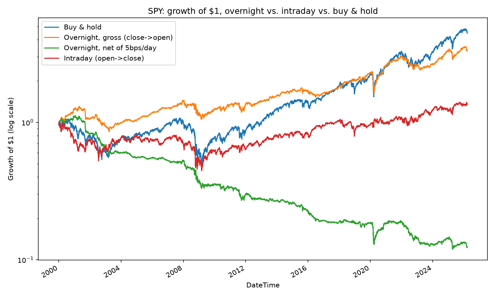

# close-and-open

Is "buy at today's close, sell at tomorrow's open" a strategy that beats the
market? This repo has a literature review and a real, runnable backtest.

**Short answer:** the overnight (close-to-open) return premium is real and
well documented — but it's not free money. Whether it "beats the market"
depends heavily on the sample period, and even a tiny per-trade cost erases
the edge. See the numbers below.

## What the literature says

1. **The pattern is real and large, gross of costs.** AQR's study of the
   S&P 500 from 1990–2020 found overnight returns averaging ~0.04%/day while
   intraday returns hovered near zero; from 1993–2013 close-to-open returns
   accounted for nearly all of the index's cumulative gain.

2. **[Lou, Polk & Skouras (2019), "A Tug of War: Overnight versus Intraday
   Expected Returns"](https://personal.lse.ac.uk/polk/research/TugOfWar.pdf)**
   (*Journal of Financial Economics*) is the leading academic account.
   Overnight returns predict future overnight returns and *reverse* future
   intraday returns (and vice versa). They attribute this to a "tug of war"
   between institutional order flow concentrated near the close and retail
   order flow concentrated near the open. Momentum profits accrue almost
   entirely overnight; several other factor premia (value, profitability,
   investment) accrue intraday instead.

3. **[Boyarchenko, Larsen & Whelan, "The Overnight Drift"](https://www.newyorkfed.org/medialibrary/media/research/staff_reports/sr917.pdf)**
   (NY Fed Staff Report) ties the overnight premium to dealer/intermediary
   inventory-risk management around the close.

4. **Fringe / non-consensus explanation:** Bruce Knuteson's
   ["Strikingly Suspicious Overnight and Intraday Returns" (2020)](https://arxiv.org/abs/2010.01727)
   and its follow-up
   ["They Still Haven't Told You" (2022)](https://arxiv.org/abs/2201.00223)
   argue the pattern is *too* clean to be a normal risk premium and
   speculate it reflects the daily rebalancing footprint of one or more
   large quant funds. This is provocative but **not** a mainstream-accepted
   explanation — treat it as a hypothesis, not settled fact.

5. **Why it's hard to actually capture:**
   [AlphaArchitect, "Trading Costs Wipe Out the Overnight Return Anomaly"](https://alphaarchitect.com/trading-costs-wipe-out-the-overnight-return-anomaly/)
   and [Elm Wealth, "Night Moves"](https://elmwealth.com/night-moves-overnight-drift/)
   both find that once bid-ask spread, commissions, and price impact are
   included, the statistically significant edge shrinks dramatically —
   closer to a random walk than a reliably repeatable strategy. Price
   impact alone (trading ~1% of a stock's daily volume in a name with 2%
   daily volatility) can cost on the order of 40bps round-trip, which is
   large relative to the average overnight edge.

6. **Practical execution point:** you can't literally transact at the
   tape-printed close/open price for free. The realistic proxy is a
   Market-on-Close buy paired with a Market-on-Open sell (or the reverse),
   each of which carries its own spread/impact cost — hence the haircut
   sweep below, rather than assuming free execution at the printed price.

## Empirical backtest (this repo)

`backtest.py` loads `data/SPY.csv` (daily OHLC, June 2000 – March 2026) and
decomposes each day's return into an **overnight** leg (`Open_t /
Close_{t-1} - 1`) and an **intraday** leg (`Close_t / Open_t - 1`), which by
construction multiply back out to the buy-and-hold return. It then applies a
flat per-round-trip cost ("haircut," in bps of notional) to the overnight
leg and reports where the strategy stops beating buy-and-hold.

> Data note: this sandbox's network policy blocks direct access to market
> data providers (Yahoo Finance, Stooq, etc.), so the script uses a vendored,
> publicly available SPY OHLC dataset rather than a live `yfinance` pull.
> It's real historical data (you can see the dot-com crash, 2008 GFC,
> 9/11 reopening gap, and the March 2020 COVID crash in it), just not fetched
> live. It is **not** dividend-adjusted, so the buy-and-hold figure below is
> a pure price return and understates SPY's true total return by roughly
> SPY's dividend yield (~1.3%/year) compounded over 26 years — a bias that,
> if corrected, would make the overnight strategy's underperformance below
> even larger, not smaller.

Run it yourself: `pip install -r requirements.txt && python backtest.py`

Results, SPY, 2000-06-06 through 2026-03-20 (6,592 trading days):

| strategy | total return | annualized return | annualized vol | Sharpe | beats buy&hold? |
|---|---:|---:|---:|---:|:---:|
| buy & hold | 345.9% | 5.88% | 19.42% | 0.30 | — |
| overnight, gross (close→open) | 231.8% | 4.69% | 11.26% | 0.42 | no |
| intraday (open→close) | 34.4% | 1.14% | 15.58% | 0.07 | no |
| overnight, net of 1bp/day | 71.6% | 2.09% | 11.26% | 0.19 | no |
| overnight, net of 2bp/day | -11.2% | -0.45% | 11.26% | -0.04 | no |
| overnight, net of 5bp/day | -87.7% | -7.70% | 11.26% | -0.68 | no |
| overnight, net of 10bp/day | -99.5% | -18.64% | 11.26% | -1.66 | no |

## Verdict

Over this ~26-year SPY sample, the overnight leg captured about two-thirds
of the market's total return (231.8% vs. 345.9%) with only about *half* the
annualized volatility of the intraday leg and a meaningfully better Sharpe
ratio (0.42 vs. 0.30 for buy-and-hold) — so the underlying pattern in the
literature clearly shows up in the data. **But it did not outright beat
buy-and-hold on raw return, even before any trading costs**, and a haircut
as small as ~2bps per round trip (a tighter cost than many retail traders
will realistically achieve on a stock, though achievable on SPY itself with
a good broker) is enough to erase the entire edge and turn it solidly
negative.

Your skepticism is well founded:
- The anomaly is real, replicated across decades and studies, and not a
  myth — but "captures nearly all the market's gains" is a period-specific
  headline stat (notably from the 1993–2013 AQR sample), not a law of
  nature. Extend the window and it can lag buy-and-hold outright.
- Whatever edge remains gross of costs is thin enough that ordinary
  transaction costs (spread + commission + price impact from an actual MOC
  buy / MOO sell) plausibly wipe it out, consistent with the AlphaArchitect
  and Elm Wealth findings cited above.
- It's a real, published academic phenomenon (Lou-Polk-Skouras, the NY Fed
  paper) with a debated cause, not a settled "free lunch" — do not size a
  live strategy off the gross numbers without your own costed backtest on
  the specific instrument and execution method you plan to use.
